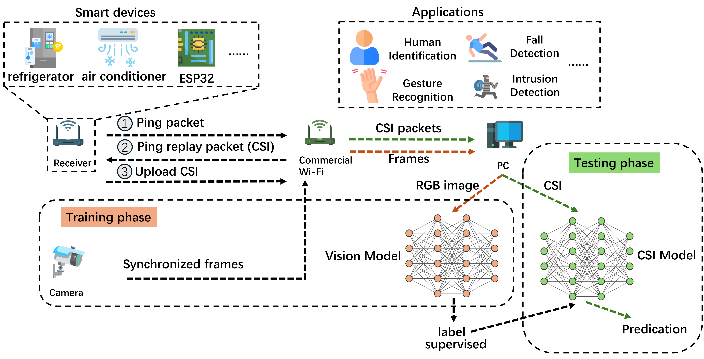

# ESP32-Realtime-System

**Device:** ESP32-S3 (supports other ESP32 models)




## 1. Introduction

First, flash [esp-csi/examples/get-started/csi_recv_router at master · espressif/esp-csi (github.com)](https://github.com/espressif/esp-csi/tree/master/examples/get-started/csi_recv_router) onto the ESP32 and connect it to the router.

Then, use the system with the following command:

```shell
python main.py --port <port>
```


For more parameters, you can obtain help with:

```shell
python main.py --help
```

**Note:** After clicking each module button, the program will start running. To stop the program, please click the corresponding button again. **Do not directly close the interface!**


## 2. Functions

- **CSI Display:** Displays CSI amplitude, phase, and spectrum data.
- **LoFi: 2D Image-Based Wi-Fi Positioning Tag Generator:** Generates positioning tags using a 2D image. Users can specify anchor points in the physical world and their corresponding pixel coordinates.
- **Intrusion Detection:** Monitors and detects unauthorized access or breaches in a designated area.
- **Fall Detection:** Identifies and alerts on incidents of falling, utilizing wireless channel state information.
- **Breathing Detection:** Monitors and analyzes breathing patterns.
- **Gesture Recognition / Action Recognition / Person Recognition / Population Estimation:** Advanced functionalities for recognizing gestures, actions, individuals, and estimating the number of people in a given space. (Pending updates)
- **Trajectory Tracking:** In development, this feature will track the movement paths of individuals or objects.

**Note:** The functionalities listed above are currently under development and will be updated as progress is made.


## 3. References

**Fall Detection**

[shawnnn3di/falldewideo](https://github.com/shawnnn3di/falldewideo)

```
@inproceedings{cai2023falldewideo,
  title={FallDeWideo: Vision-Aided Wireless Sensing Dataset for Fall Detection with Commodity Wi-Fi Devices},
  author={Cai, Zhijie and Chen, Tingwei and Zhou, Fujia and Cui, Yuanhao and Li, Hang and Li, Xiaoyang and Zhu, Guangxu and Shi, Qingjiang},
  booktitle={Proceedings of the 3rd ACM MobiCom Workshop on Integrated Sensing and Communications Systems},
  pages={7--12},
  year={2023}
}
```

```
@article{chen2024deep,
  title={Deep learning-based fall detection using commodity Wi-Fi},
  author={Chen, Tingwei and Li, Xiaoyang and Li, Hang and Zhu, Guangxu},
  journal={Journal of Information and Intelligence},
  year={2024},
  publisher={Elsevier}
}
```

```
@article{陈廷尉2023基于无线信道状态信息的跌倒检测,
  title={基于无线信道状态信息的跌倒检测},
  author={陈廷尉 and 李阳 and 韩凯峰 and 李晓阳 and 李航 and 朱光旭},
  journal={信息通信技术与政策},
  volume={49},
  number={9},
  pages={67},
  year={2023}
}
```


**Gesture Recognition / Action Recognition / Person Recognition / Population Estimation**

[RS2002/CSI-BERT: Official Repository for The Paper, Finding the Missing Data: A BERT-inspired Approach Against Package Loss in Wireless Sensing](https://github.com/RS2002/CSI-BERT)

[RS2002/CSI-BERT2: Official Repository for The Paper,Mining Limited Data Sufficiently: A BERT-inspired Approach for CSI Time Series Application in Wireless Communication and Sensing](https://github.com/RS2002/CSI-BERT2)

[RS2002/CrossFi: Official Repository for The Paper, CrossFi: A Cross Domain Wi-Fi Sensing Framework Based on Siamese Network](https://github.com/RS2002/CrossFi)

[RS2002/KNN-MMD: Official Repository for The Paper,KNN-MMD: Cross Domain Wireless Sensing via Local Distribution Alignmen](https://github.com/RS2002/KNN-MMD)


```
@inproceedings{zhang2023ratiofi,
  title={RatioFi: Unlocking the Potential of WiFi CSI},
  author={Zhang, Dengtao and Cai, Zhijie and Zhu, Guangxu and Li, Hang and Li, Xiaoyang and Shi, Qingjiang and Shen, Chao},
  booktitle={2023 International Conference on Ubiquitous Communication (Ucom)},
  pages={421--425},
  year={2023},
  organization={IEEE}
}
```

```
@INPROCEEDINGS{10620769,
  author={Zhao, Zijian and Chen, Tingwei and Meng, Fanyi and Li, Hang and Li, Xiaoyang and Zhu, Guangxu},
  booktitle={IEEE INFOCOM 2024 - IEEE Conference on Computer Communications Workshops (INFOCOM WKSHPS)}, 
  title={Finding the Missing Data: A BERT-Inspired Approach Against Package Loss in Wireless Sensing}, 
  year={2024},
  volume={},
  number={},
  pages={1-6},
  keywords={Deep learning;Wireless communication;Interpolation;Wireless sensor networks;Transformers;Data models;Sensors;Bidirectional Encoder Representations from Transformers;Adversarial Learning;Data Recovery;Channel Statement Information;Wi-Fi Sensing},
  doi={10.1109/INFOCOMWKSHPS61880.2024.10620769}}
```

```
@article{zhao2024mining,
  title={Mining Limited Data Sufficiently: A BERT-inspired Approach for CSI Time Series Application in Wireless Communication and Sensing},
  author={Zhao, Zijian and Meng, Fanyi and Li, Hang and Li, Xiaoyang and Zhu, Guangxu},
  journal={arXiv preprint arXiv:2412.06861},
  year={2024}
}
```

```
@article{zhao2024crossfi,
  title={CrossFi: A Cross Domain Wi-Fi Sensing Framework Based on Siamese Network},
  author={Zhao, Zijian and Chen, Tingwei and Cai, Zhijie and Li, Xiaoyang and Li, Hang and Chen, Qimei and Zhu, Guangxu},
  journal={arXiv preprint arXiv:2408.10919},
  year={2024}
}
```

```
@misc{zhao2025knnmmdcrossdomainwireless,
      title={KNN-MMD: Cross Domain Wireless Sensing via Local Distribution Alignment}, 
      author={Zijian Zhao and Zhijie Cai and Tingwei Chen and Xiaoyang Li and Hang Li and Qimei Chen and Guangxu Zhu},
      year={2025},
      eprint={2412.04783},
      archivePrefix={arXiv},
      primaryClass={cs.CV},
      url={https://arxiv.org/abs/2412.04783}, 
}
```


**Tracking / Localization**

[RS2002/LoFi: Official Repository for The Paper, LoFi: Vision-Aided Label Generator for Wi-Fi Location and Tracing](https://github.com/RS2002/LoFi)

```
@article{zhao2024lofi,
  title={LoFi: Vision-Aided Label Generator for Wi-Fi Localization and Tracking},
  author={Zhao, Zijian and Chen, Tingwei and Meng, Fanyi and Cai, Zhijie and Li, Hang and Li, Xiaoyang and Zhu, Guangxu},
  journal={arXiv preprint arXiv:2412.05074},
  year={2024}
}
```
