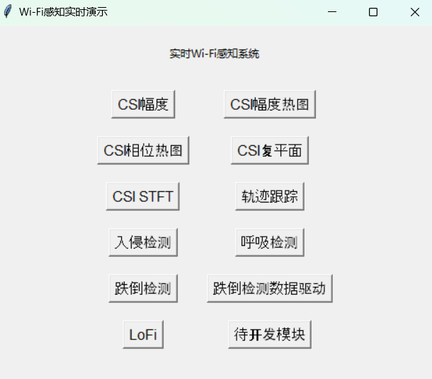

# ESP32-Realtime-System

**开发者：** 赵子健、陈廷尉、孟繁一、蔡智捷 

**设备：** ESP32-S3 （支持ESP32其他型号）


## 1. 简介

首先向ESP32中烧入[esp-csi/examples/get-started/csi_recv_router at master · espressif/esp-csi (github.com)](https://github.com/espressif/esp-csi/tree/master/examples/get-started/csi_recv_router)，并连接至router

之后通过如下命令使用系统

```shell
python main.py --port <port>
```



更多参数可使用获取

```shell
python main.py --help
```


**注意：**点击各模块按钮后程序开始运行，若要停止程序请再次点击对应按钮，**不要直接关闭界面！不要直接关闭界面！不要直接关闭界面！**


## 2. 使用说明

### CSI显示模块

可显示内容包括：CSI幅度、相位、频谱


### LoFi：基于2D图像的Wi-Fi定位标签生成器

请在提供参数 ``src_points``:四个不共线锚点在物理世界的坐标（任意单位均可）；``cv_model_path``存储目标检测模型的路径，目前默认路径使用YOLOv3，也可以更换为其他模型；``dst_points``为四个锚点在像素空间的坐标，可以选择性题提供（若不提供，则可以直接在图片中依次点击四个锚点，程序会依次返回对应坐标并存储于dst_points）


### 入侵检测


###跌倒检测


### 呼吸检测


###手势识别/动作识别/人员识别/人数估计

待更新


### 轨迹跟踪

开发中


##3. 引用

更新中

**跌倒检测**

```
@article{chen2024deep,
  title={Deep learning-based fall detection using commodity Wi-Fi},
  author={Chen, Tingwei and Li, Xiaoyang and Li, Hang and Zhu, Guangxu},
  journal={Journal of Information and Intelligence},
  year={2024},
  publisher={Elsevier}
}
```

```
@article{陈廷尉2023基于无线信道状态信息的跌倒检测,
  title={基于无线信道状态信息的跌倒检测},
  author={陈廷尉 and 李阳 and 韩凯峰 and 李晓阳 and 李航 and 朱光旭},
  journal={信息通信技术与政策},
  volume={49},
  number={9},
  pages={67},
  year={2023}
}
```

```
@inproceedings{cai2023falldewideo,
  title={FallDeWideo: Vision-Aided Wireless Sensing Dataset for Fall Detection with Commodity Wi-Fi Devices},
  author={Cai, Zhijie and Chen, Tingwei and Zhou, Fujia and Cui, Yuanhao and Li, Hang and Li, Xiaoyang and Zhu, Guangxu and Shi, Qingjiang},
  booktitle={Proceedings of the 3rd ACM MobiCom Workshop on Integrated Sensing and Communications Systems},
  pages={7--12},
  year={2023}
}
```


**手势识别/动作识别/人员识别/人数估计**

```
@article{zhao2024finding,
  title={Finding the Missing Data: A BERT-inspired Approach Against Package Loss in Wireless Sensing},
  author={Zhao, Zijian and Chen, Tingwei and Meng, Fanyi and Li, Hang and Li, Xiaoyang and Zhu, Guangxu},
  journal={arXiv preprint arXiv:2403.12400},
  year={2024}
}
```

